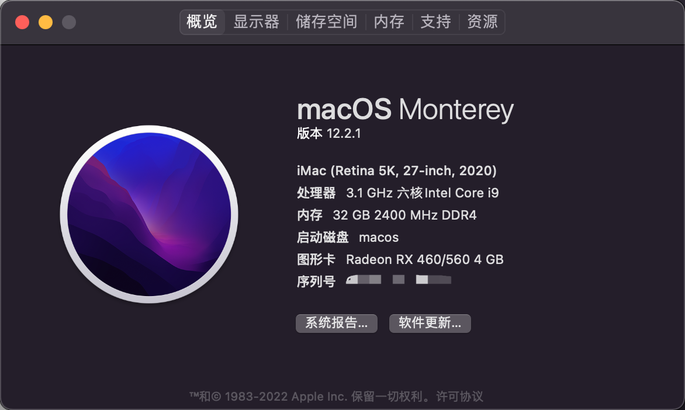

折腾记录：[B460M+i10500黑苹果记录](https://hijerry.cn/p/43141.html)

# 配置概览

MacOS：12.2.1

显示器：U2790B 4K

主板：微星 B460m 迫击炮 （非wifi版）

CPU：Intel(R) Core(TM) i5-10500 CPU @ 3.10GHz，Coffee Lake

显卡：核显 UHD Graphics 630，独显 蓝宝石 RX460 白金版 4G

硬盘：三星 970 EVO 500G，M.2 

内存：光威 16GB * 2

无线网卡：BCM 94360CD （免驱）

